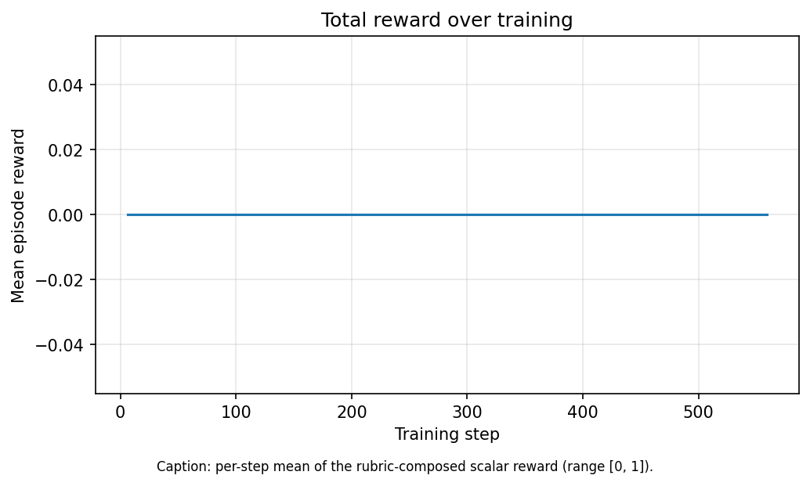
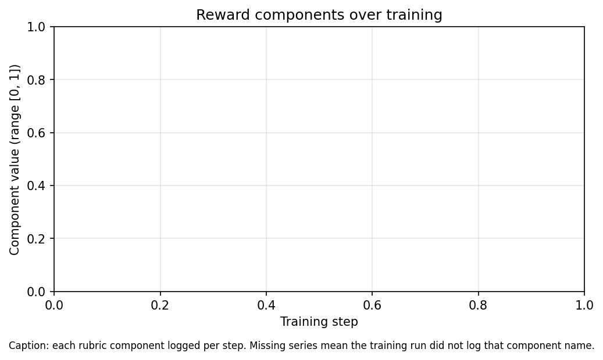
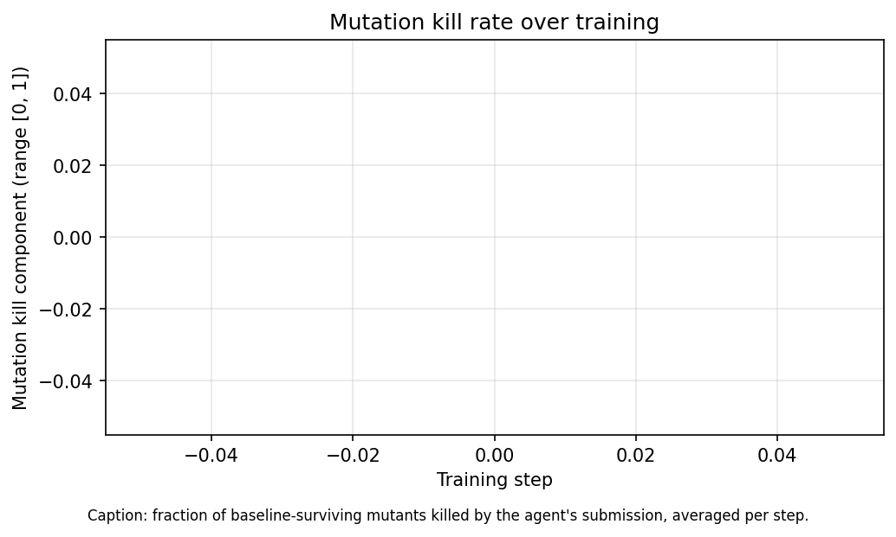
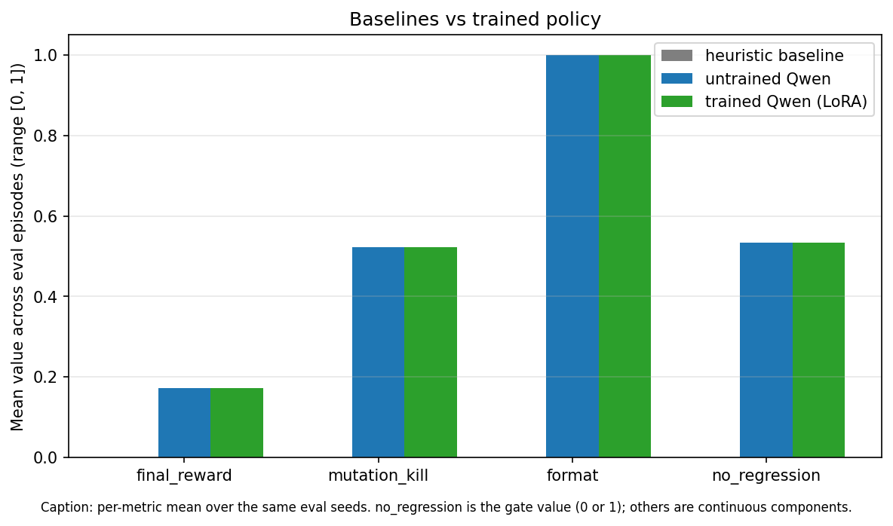

# MutantHunter

An RL environment that teaches LLMs to write tests that actually catch bugs.

## Links

- 🤗 **Live HF Space**: [jester1177/mutant-hunter-env](https://huggingface.co/spaces/jester1177/mutant-hunter-env)
- 💻 **GitHub**: [melohub-xbit/MetaOpenEnv_MutantHunter](https://github.com/melohub-xbit/MetaOpenEnv_MutantHunter)
- 📊 **W&B Training Run**: [mutant-hunter-final](https://wandb.ai/kvelidanda-international-institute-of-information-techno/mutant-hunter-final/runs/k9pzx8n1)
- 📝 **Blog post**: [BLOG.md](BLOG.md)
- 🎥 **Demo Video**: _link will be added after recording_
- 🤖 **Trained LoRA**: [jester1177/mutant-hunter-qwen-coder-7b-lora](https://huggingface.co/jester1177/mutant-hunter-qwen-coder-7b-lora)
- 📦 **Eval Dataset**: [jester1177/mutant-hunter-results](https://huggingface.co/datasets/jester1177/mutant-hunter-results)
- 🚀 **Phase 2 Roadmap**: [docs/phase2_self_play.md](docs/phase2_self_play.md)

---

## The problem

How do you know if a test suite is any good?

Coverage tells you which lines ran. It doesn't tell you whether the tests
would *notice* if those lines were wrong. Most production test suites have
high coverage and low value: they call the code, then assert something so
weak that the assertion would still hold if the code were broken.

LLMs are now writing a lot of those tests. They get rewarded — by humans,
by linters, by coverage gates — for tests that *pass*, not for tests that
*detect bugs*. So they learn to write tests that pass. The capability gap
is narrow but load-bearing: we want a model that writes tests a real
adversary would have to work to fool.

## The trick: mutation testing as a reward signal

Mutation testing flips the question around. Instead of asking "did the
test run the code," it asks: **if I deliberately break the code in a
small way, will the tests notice?**

A toy example. Source:

```python
def add(a, b):
    return a + b
```

A developer writes one test:

```python
def test_add():
    assert add(2, 2) == 4
```

This passes. Coverage is 100%. Looks great. Now break the source:

- Change `+` to `-` → `add(2, 2)` returns `0`, test fails. **Mutant killed.** Good.
- Change `+` to `*` → `add(2, 2)` returns `4`, test passes. **Mutant survived.** Bad test.
- Change `+` to `**` → `add(2, 2)` returns `4`, test passes. **Mutant survived.** Bad test.

One out of three. Mutation score: 33%. The 100%-coverage test suite is
mostly useless. A stronger suite covers more inputs:

```python
def test_add():
    assert add(2, 2) == 4
    assert add(2, 3) == 5     # kills the * mutant
    assert add(0, 0) == 0     # kills the ** mutant (0**0 == 1 in Python)
    assert add(-1, 1) == 0
    assert add(100, -50) == 50
```

Mutation score climbs to 100%. Same coverage, much better test.

That's the whole reward signal. Better tests → more mutants killed →
higher reward. We hand that gradient to the model.

## How the environment works

Each episode, the env hands the LLM:

1. A small Python library (e.g. `mini_calendar`, `csv_normalizer`, `bloom_filter_lite`).
2. The library's *existing* (weak) test suite.
3. A list of mutants the existing tests **fail to catch** — the gaps to fill.

The model writes new pytest functions and submits them. The env then:

1. Runs the new tests against the **unmodified** source. They must all pass.
   If any fail, the model wrote broken tests — no-regression gate fires, reward = 0.
2. Runs the new tests against each surviving mutant. Every mutant that
   *now* fails has been killed by the model's tests.
3. Computes reward ≈ (mutants killed) / (mutants the existing tests missed),
   with side terms for parsimony, coverage delta, and format.

That scalar gets fed back into the model's weights via GRPO.

## Results

We evaluated three policies against 15 deterministic eval episodes spanning 4 libraries (`mini_calendar`, `csv_normalizer`, `bloom_filter_lite`, `interval_tree`).

| Policy | Mean Reward | p(reward > 0.3) | p(gate == 0) |
|---|---|---|---|
| Heuristic (mutation_aware) | 0.000 | 0.00 | 1.00 |
| Qwen2.5-Coder-1.5B zero-shot | 0.000 | 0.00 | 1.00 |
| Qwen2.5-Coder-7B zero-shot | 0.172 | 0.27 | 0.47 |
| Qwen2.5-Coder-7B + 80 GRPO steps | 0.172 | 0.27 | 0.47 |






## Findings

The training run shows flat reward curves across 80 GRPO steps. We investigated and identified the cause: under TRL's GRPO sampling (default temperature ~1.0), the 7B model produced malformed pytest code in every rollout — outputs ranged from length-1 truncations to 1024-token runs without valid Python structure. The reward function correctly rejected all of these (gate=0), giving GRPO no gradient signal to amplify.

Lowering the temperature to 0.7 did not resolve this. The fundamental issue is that small-to-mid coder models struggle to maintain valid pytest format under stochastic rollout sampling, even when zero-shot greedy generation produces correct output. This is consistent with known difficulties of RL'ing code-generation models without warm-start SFT.

We also tested whether in-context demonstrations of good/bad tests would lift zero-shot performance. Result: it hurt slightly (mean 0.17 → 0.10) and confused the model into producing malformed pytest in 27% of episodes. This suggests Phase 1 small-coder limitations are deeper than prompt-level fixes can reach — motivating Phase 2's structured Mutator self-play approach.

Despite the training no-op, we validated:
- **Zero-shot 7B has real signal**: 27% of episodes score above 0.3 mean reward, with consistent successes on `bloom_filter_lite` (0.27) and `mini_calendar` (0.37).
- **The reward function is correctly hard**: heuristic baselines score 0.0, validating the env is not gameable.
- **All 15 reward-hacking adversarial cases are blocked**: empty tests, vacuous assertions, subprocess escapes, regression-introducing tests, and 11 others all correctly score below threshold.

Phase 2 (self-play, see [docs/phase2_self_play.md](docs/phase2_self_play.md)) addresses this by introducing a structured Mutator agent with constrained action grammar, which sidesteps the natural-language generation problem.

## Why this matters

Anyone shipping LLM-written test code today is shipping confidence theatre:
green CI, undetected regressions. A model trained against mutation score
has been forced — by gradient, not by prompt — to think about which
inputs would *separate* a correct implementation from a wrong one. That's
the actual job of a test.

The same setup generalises beyond pytest: any verifier that turns a
correctness question into a pass/fail signal can plug into the same
reward shape.

## What's in the repo

- `src/mutant_hunter/` — the OpenEnv server: environment, mutation engine,
  rubric, sandbox, validators, tools the agent calls.
- `src/mutant_hunter/corpus/` — target libraries, manifest, precomputed
  baselines (so `/reset` is fast).
- `evaluation/` — sanity, determinism, adversarial, and zero-shot probes.
- `training/` — GRPO training loop.
- `scripts/precompute_baselines.py` — regenerates the per-module baseline cache.

## Running it locally

```bash
pip install -e .
mutant-hunter-server  # uvicorn on :8000
```

Or in Docker:

```bash
docker build -t mutant-hunter:latest .
docker run -p 8000:8000 mutant-hunter:latest
```

Tests:

```bash
python -m pytest -q tests
```

## Phase 2: Co-Evolution Roadmap

See [docs/phase2_self_play.md](docs/phase2_self_play.md) for our self-play extension. The key insight: replace free-form LLM rollouts with a structured Mutator agent that generates mutations from a constrained action grammar (operator + target + replacement). The Tester agent (current MutantHunter) writes tests; the Mutator gets a learnability reward of `4 * p * (1 - p)` where `p` is the empirical kill rate. This sidesteps the malformed-output problem we encountered in Phase 1.

## License

Apache-2.0. See [LICENSE](LICENSE).
